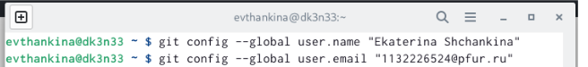
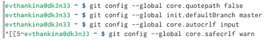
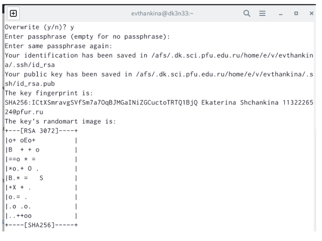
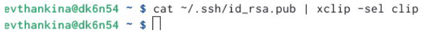
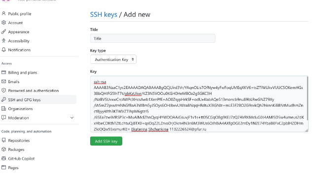
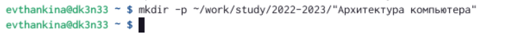
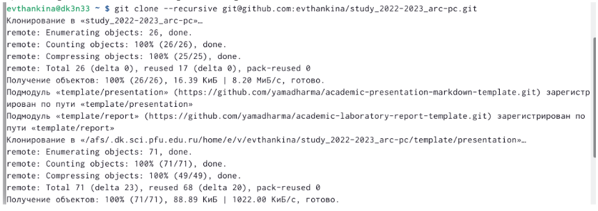
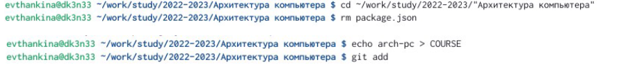
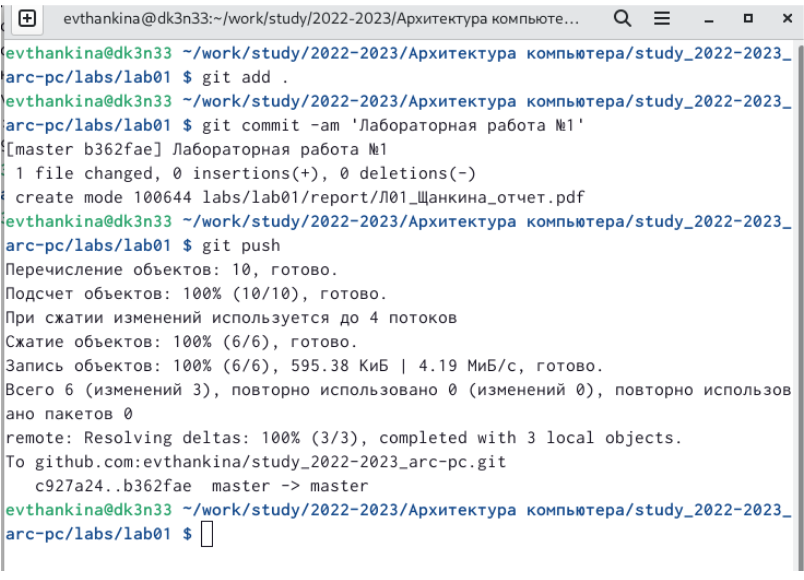
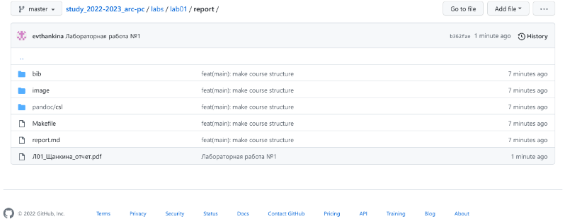

---
## Front matter
title: "Отчет"
subtitle: "Лабораторная работа №3"
author: "Щанкина Екатерина Викторовна"

## Generic otions
lang: ru-RU
toc-title: "Содержание"

## Bibliography
bibliography: bib/cite.bib
csl: pandoc/csl/gost-r-7-0-5-2008-numeric.csl

## Pdf output format
toc: true # Table of contents
toc-depth: 2
lof: true # List of figures
lot: true # List of tables
fontsize: 12pt
linestretch: 1.5
papersize: a4
documentclass: scrreprt
## I18n polyglossia
polyglossia-lang:
  name: russian
  options:
	- spelling=modern
	- babelshorthands=true
polyglossia-otherlangs:
  name: english
## I18n babel
babel-lang: russian
babel-otherlangs: english
## Fonts
mainfont: PT Serif
romanfont: PT Serif
sansfont: PT Sans
monofont: PT Mono
mainfontoptions: Ligatures=TeX
romanfontoptions: Ligatures=TeX
sansfontoptions: Ligatures=TeX,Scale=MatchLowercase
monofontoptions: Scale=MatchLowercase,Scale=0.9
## Biblatex
biblatex: true
biblio-style: "gost-numeric"
biblatexoptions:
  - parentracker=true
  - backend=biber
  - hyperref=auto
  - language=auto
  - autolang=other*
  - citestyle=gost-numeric
## Pandoc-crossref LaTeX customization
figureTitle: "Рис."
tableTitle: "Таблица"
listingTitle: "Листинг"
lofTitle: "Список иллюстраций"
lotTitle: "Список таблиц"
lolTitle: "Листинги"
## Misc options
indent: true
header-includes:
  - \usepackage{indentfirst}
  - \usepackage{float} # keep figures where there are in the text
  - \floatplacement{figure}{H} # keep figures where there are in the text
---

# Цель работы

Целью работы является изучить идеологию и применение средств
контроля версий. Приобрести практические навыки по работе с системой git.

# Задание

Изучить идеологию и применение средств
контроля версий и приобрести практические навыки по работе с системой git.

# Теоретическое введение

Здесь описываются теоретические аспекты, связанные с выполнением работы.

Например, в табл. [-@tbl:std-dir] приведено краткое описание стандартных каталогов Unix.

: Описание некоторых каталогов файловой системы GNU Linux {#tbl:std-dir}

| Имя каталога | Описание каталога                                                                                                          |
|--------------|----------------------------------------------------------------------------------------------------------------------------|
| `/`          | Корневая директория, содержащая всю файловую                                                                               |
| `/bin `      | Основные системные утилиты, необходимые как в однопользовательском режиме, так и при обычной работе всем пользователям     |
| `/etc`       | Общесистемные конфигурационные файлы и файлы конфигурации установленных программ                                           |
| `/home`      | Содержит домашние директории пользователей, которые, в свою очередь, содержат персональные настройки и данные пользователя |
| `/media`     | Точки монтирования для сменных носителей                                                                                   |
| `/root`      | Домашняя директория пользователя  `root`                                                                                   |
| `/tmp`       | Временные файлы                                                                                                            |
| `/usr`       | Вторичная иерархия для данных пользователя                                                                                 |

Более подробно об Unix см. в [@gnu-doc:bash;@newham:2005:bash;@zarrelli:2017:bash;@robbins:2013:bash;@tannenbaum:arch-pc:ru;@tannenbaum:modern-os:ru].

# Выполнение лабораторной работы

1)Создала учётную запись на сайте https://github.com/ и заполнила основные
данные.

2) Сделала предварительную конфигурацию git. Открыла терминал и
ввела команды, указав имя и email. (рис. [-@fig:fig1])

3) Настроила utf-8 в выводе сообщений git, задала имя начальной ветки, параметр
autocrlf, параметр safecrlf.(рис. [-@fig:fig2])

4)Сгенерировала пару ключей (приватный и открытый)(рис. [-@fig:fig3])

5) Скопировала ключ с помощью команды.(рис. [-@fig:fig4])

6) Загрузила сгенерённый открытый ключ на github.(рис. [-@fig:fig5])

7) Создала каталог для предмета «Архитектура компьютера». (рис. [-@fig:fig6])

8)Клонировала созданный репозиторий.(рис. [-@fig:fig7])

9) Перешла в каталог курса, удалила лишние файлы, а также создала необходимые
каталоги и отправила файлы на сервер. (рис. [-@fig:fig8])

{ #fig:fig1 width=70% }

{ #fig:fig2 width=70% }

{ #fig:fig3 width=70% }

{ #fig:fig4 width=70% }

{ #fig:fig5 width=70% }

{ #fig:fig6 width=70% }

{ #fig:fig7 width=70% }

{ #fig:fig8 width=70% }

# Самостоятельная работа

1) После создания этого отчета, загружаем его в определенную папку и выгружаем в
github.
2) То же самое делаем с лабораторными 1 и 2. (рис. [-@fig:fig9]) (рис. [-@fig:fig10])

{ #fig:fig9 width=70% }

{ #fig:fig10 width=70% }

# Выводы

Изучила идеологию и применение средств контроля версий. А также
приобрела практические навыки по работе с системой git.

# Список литературы{.unnumbered}

::: {#refs}
:::
