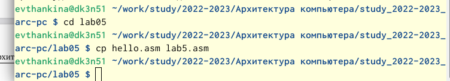

---
## Front matter
title: "Отчет"
subtitle: "Лабораторная работа №5"
author: "Щанкина Екатерина Викторовна"

## Generic otions
lang: ru-RU
toc-title: "Содержание"

## Bibliography
bibliography: bib/cite.bib
csl: pandoc/csl/gost-r-7-0-5-2008-numeric.csl

## Pdf output format
toc: true # Table of contents
toc-depth: 2
lof: true # List of figures
lot: true # List of tables
fontsize: 12pt
linestretch: 1.5
papersize: a4
documentclass: scrreprt
## I18n polyglossia
polyglossia-lang:
  name: russian
  options:
	- spelling=modern
	- babelshorthands=true
polyglossia-otherlangs:
  name: english
## I18n babel
babel-lang: russian
babel-otherlangs: english
## Fonts
mainfont: PT Serif
romanfont: PT Serif
sansfont: PT Sans
monofont: PT Mono
mainfontoptions: Ligatures=TeX
romanfontoptions: Ligatures=TeX
sansfontoptions: Ligatures=TeX,Scale=MatchLowercase
monofontoptions: Scale=MatchLowercase,Scale=0.9
## Biblatex
biblatex: true
biblio-style: "gost-numeric"
biblatexoptions:
  - parentracker=true
  - backend=biber
  - hyperref=auto
  - language=auto
  - autolang=other*
  - citestyle=gost-numeric
## Pandoc-crossref LaTeX customization
figureTitle: "Рис."
tableTitle: "Таблица"
listingTitle: "Листинг"
lofTitle: "Список иллюстраций"
lotTitle: "Список таблиц"
lolTitle: "Листинги"
## Misc options
indent: true
header-includes:
  - \usepackage{indentfirst}
  - \usepackage{float} # keep figures where there are in the text
  - \floatplacement{figure}{H} # keep figures where there are in the text
---

# Цель работы

Освоение процедуры компиляции и сборки программ, написанных на ассемблере NASM.

# Задание

Освоить процедуры компиляции и сборки программ.

# Выполнение лабораторной работы

1) Создала каталог для работы с программами на языке ассемблера NASM. (рис. [-@fig:fig1])

2)Перешла в созданный каталог и открыла этот файл с помощью текстового редактора, а также ввела в него текст.(рис. [-@fig:fig2])

3)Прокомпилировала приведённый текст, с помощью команды: 
"nasm -f elf hello.asm".

4)Cкомпилировала исходный файл hello.asm в obj.o (рис. [-@fig:fig3])

5)Объектный файл передала на обработку компоновщику. 

6)Выполнила следующую команду:
"ld -m elf_i386 obj.o -o main" (рис. [-@fig:fig4]) 

7)Запустила на выполнение созданный исполняемый файл. (рис. [-@fig:fig4]) 

{ #fig:fig1 width=70% }

{ #fig:fig2 width=70% }

{ #fig:fig3 width=70% }

{ #fig:fig4 width=70% }

# Выполнение самостоятельной работы

1)С помощью команды cp создала копию файла hello.asm с именем lab5.asm. (рис. [-@fig:fig6]) 

2)С помощью текстового редактора внесла изменения в текст программы в файле lab5.asm так, чтобы вместо Hello world! на экран выводилась строка с моими фамилией и именем. (рис. [-@fig:fig7]) 

3)Оттранслировала полученный текст программы lab5.asm в объектный файл. Выполнила компоновку объектного файла и запустила получившийся исполняемый файл.

4)Скопировала файлы hello.asm и lab5.asm в мой локальный репозиторий в каталог. Загрузила файлы на GitHub. (рис. [-@fig:fig8]) (рис. [-@fig:fig9]) 

{ #fig:fig6 width=70% }

{ #fig:fig7 width=70% }

{ #fig:fig8 width=70% }

{ #fig:fig9 width=70% }

# Выводы

Освоила процедуры компиляции и сборки программ, написанных на ассемблере NASM.

