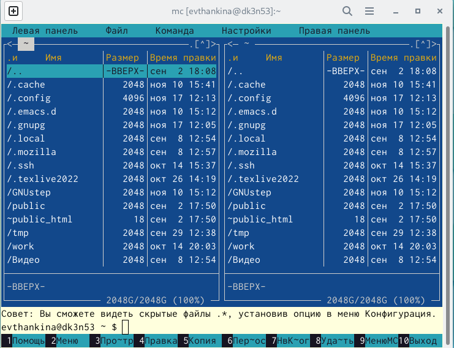
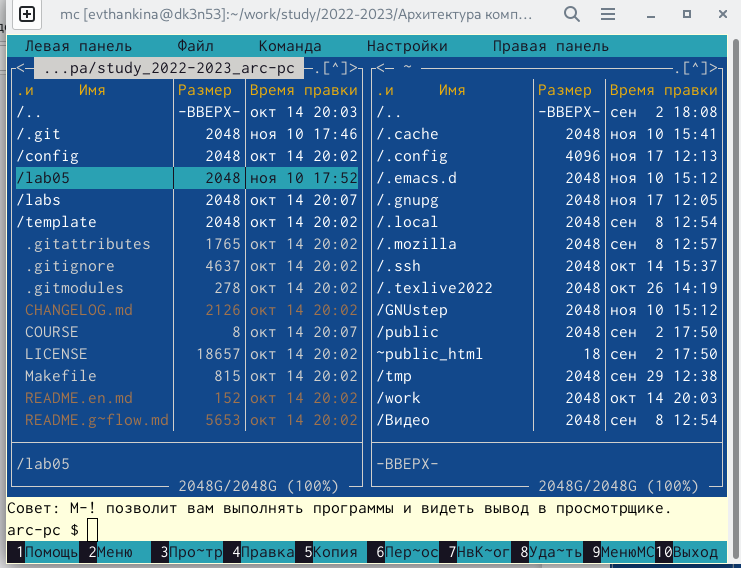
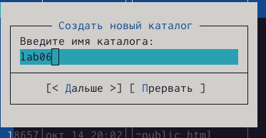
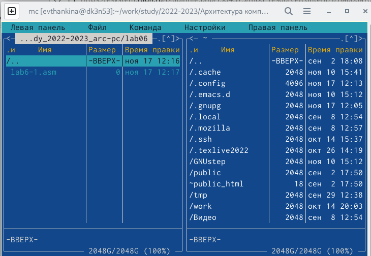
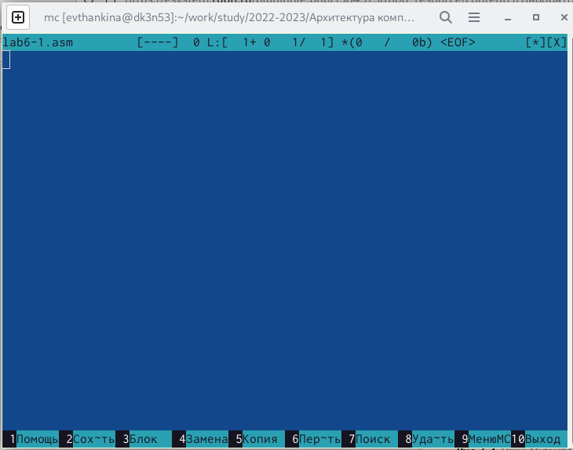
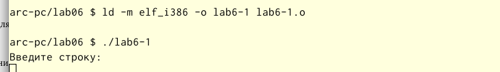
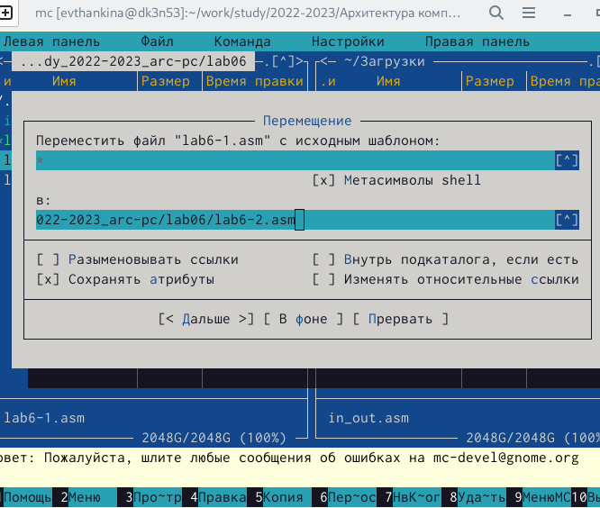
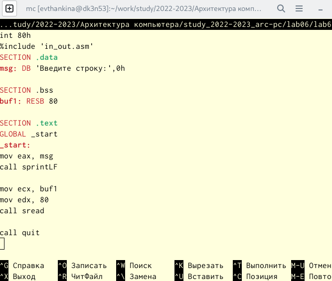
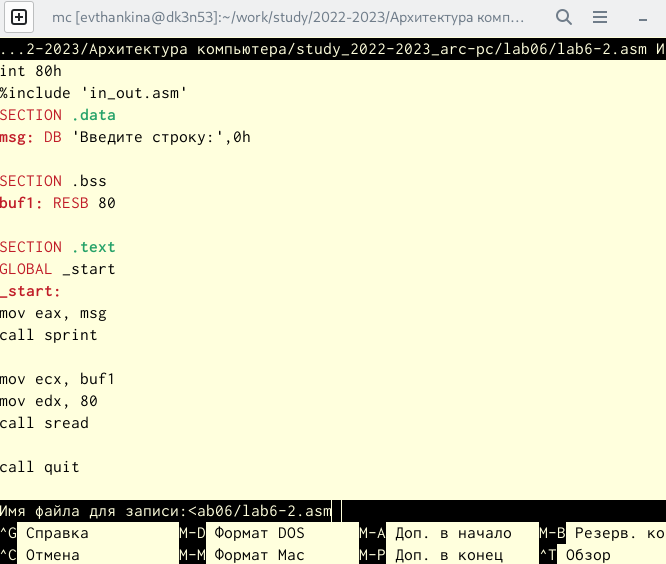
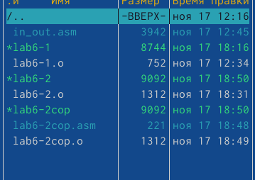

---
## Front matter
title: "Отчет"
subtitle: "Лабораторная работа №6"
author: "Щанкина Екатерина Викторовна"

## Generic otions
lang: ru-RU
toc-title: "Содержание"

## Bibliography
bibliography: bib/cite.bib
csl: pandoc/csl/gost-r-7-0-5-2008-numeric.csl

## Pdf output format
toc: true # Table of contents
toc-depth: 2
lof: true # List of figures
lot: true # List of tables
fontsize: 12pt
linestretch: 1.5
papersize: a4
documentclass: scrreprt
## I18n polyglossia
polyglossia-lang:
  name: russian
  options:
	- spelling=modern
	- babelshorthands=true
polyglossia-otherlangs:
  name: english
## I18n babel
babel-lang: russian
babel-otherlangs: english
## Fonts
mainfont: PT Serif
romanfont: PT Serif
sansfont: PT Sans
monofont: PT Mono
mainfontoptions: Ligatures=TeX
romanfontoptions: Ligatures=TeX
sansfontoptions: Ligatures=TeX,Scale=MatchLowercase
monofontoptions: Scale=MatchLowercase,Scale=0.9
## Biblatex
biblatex: true
biblio-style: "gost-numeric"
biblatexoptions:
  - parentracker=true
  - backend=biber
  - hyperref=auto
  - language=auto
  - autolang=other*
  - citestyle=gost-numeric
## Pandoc-crossref LaTeX customization
figureTitle: "Рис."
tableTitle: "Таблица"
listingTitle: "Листинг"
lofTitle: "Список иллюстраций"
lotTitle: "Список таблиц"
lolTitle: "Листинги"
## Misc options
indent: true
header-includes:
  - \usepackage{indentfirst}
  - \usepackage{float} # keep figures where there are in the text
  - \floatplacement{figure}{H} # keep figures where there are in the text
---

# Цель работы

Приобретение практических навыков работы в Midnight Commander. Освоение
инструкций языка ассемблера mov и int.

# Задание

Приобрести практические навыки работы в Midnight Commander, а также освоить
инструкцию языка ассемблера mov и int.

# Выполнение лабораторной работы

1. Открыла Midnight Commander. (рис. [-@fig:001])

2. Перешла в каталог, созданный при выполнении лабораторной работы №5. (рис. [-@fig:002])

3. С помощью функциональной клавиши F7 создала папку lab06 и перешла в созданный каталог.(рис. [-@fig:003])

4. Пользуясь строкой ввода и командой touch создала файл lab6-1.asm (рис. [-@fig:004])

5. С помощью функциональной клавиши F4 открыла файл lab6-1.asm для редактирования во встроенном редакторе.(рис. [-@fig:005])

6. Ввела текст программы, сохранила изменения и закрыла файл.

7. С помощью функциональной клавиши F3 открыла файл lab6-1.asm для просмотра и убедилась, что файл содержит текст программы.

8. Оттранслировала текст программы lab6-1.asm в объектный файл. Выполнила компоновку объектного файла и запустила получившийся исполняемый файл.(рис. [-@fig:006])

9. Скачала файл in_out.asm со страницы курса в ТУИС.

10. Перенесла подключаемый файл in_out.asm в каталог, что и
файл с программой, в которой он используется.

11. С помощью функциональной клавиши F6 создала копию файла lab6-1.asm с именем lab6-2.asm. (рис. [-@fig:007])

12. Исправила текст программы в файле lab6-2.asm с использование подпрограмм из внешнего файла in_out.asm. Создала исполняемый файл и проверила его работу.(рис. [-@fig:008])

13. В файле lab6-2.asm заменила подпрограмму sprintLF на sprint. (рис. [-@fig:009])

{ #fig:001 width=70% }

{ #fig:002 width=70% }

{ #fig:003 width=70% }

{ #fig:004 width=70% }

{ #fig:005 width=70% }

{ #fig:006 width=70% }

{ #fig:007 width=70% }

{ #fig:008 width=70% }

{ #fig:009 width=70% }

# Выполнение самостоятельной работы

1. Создала копию файла lab6-1.asm, внесла изменения в программу, так чтобы она работала по определенному алгоритму.

2. Получила исполняемый файл и проверила его работу.(рис. [-@fig:0010])

3. Создала копию файла lab6-2.asm. Исправила текст программы с исполь-
зованием подпрограмм из внешнего файла in_out.asm, так чтобы она ра-
ботала по определенному алгоритму.

4. Создала исполняемый файл и проверила его работу. (рис. [-@fig:0011])

{ #fig:0010 width=70% }

{ #fig:0011 width=70% }

# Выводы

Приобрела практические навыки работы в Midnight Commander и освоила
инструкции языка ассемблера mov и int.

