---
## Front matter
title: "Отчет"
subtitle: "Лабораторная работа №7"
author: "Щанкина Екатерина Викторовна"

## Generic otions
lang: ru-RU
toc-title: "Содержание"

## Bibliography
bibliography: bib/cite.bib
csl: pandoc/csl/gost-r-7-0-5-2008-numeric.csl

## Pdf output format
toc: true # Table of contents
toc-depth: 2
lof: true # List of figures
lot: true # List of tables
fontsize: 12pt
linestretch: 1.5
papersize: a4
documentclass: scrreprt
## I18n polyglossia
polyglossia-lang:
  name: russian
  options:
	- spelling=modern
	- babelshorthands=true
polyglossia-otherlangs:
  name: english
## I18n babel
babel-lang: russian
babel-otherlangs: english
## Fonts
mainfont: PT Serif
romanfont: PT Serif
sansfont: PT Sans
monofont: PT Mono
mainfontoptions: Ligatures=TeX
romanfontoptions: Ligatures=TeX
sansfontoptions: Ligatures=TeX,Scale=MatchLowercase
monofontoptions: Scale=MatchLowercase,Scale=0.9
## Biblatex
biblatex: true
biblio-style: "gost-numeric"
biblatexoptions:
  - parentracker=true
  - backend=biber
  - hyperref=auto
  - language=auto
  - autolang=other*
  - citestyle=gost-numeric
## Pandoc-crossref LaTeX customization
figureTitle: "Рис."
listingTitle: "Листинг"
lofTitle: "Список иллюстраций"
lolTitle: "Листинги"
## Misc options
indent: true
header-includes:
  - \usepackage{indentfirst}
  - \usepackage{float} # keep figures where there are in the text
  - \floatplacement{figure}{H} # keep figures where there are in the text
---

# Цель работы

Освоение арифметических инструкций языка ассемблера NASM.

# Задание

Освоить арифметические инструкции языка ассемблера NASM.

# Выполнение лабораторной работы

1. Создала каталог и перешла в него и создала файл lab-1.asm (рис. [-@fig:001])

2. Рассмотрела примеры программ вывода символьных и численных значений.Создала исполняемый файл и запустила его. (рис. [-@fig:002]) (рис. [-@fig:003])

3. Далее изменила текст программы и вместо символов, записала в регистры числа. 
 (рис. [-@fig:004]) (рис. [-@fig:005])
 
4. Создала файл lab-2.asm в каталоге и ввела в него
текст программы из листинга 7.2. (рис. [-@fig:006]) (рис. [-@fig:007])

5. Аналогично предыдущему изменим символы на числа. (рис. [-@fig:008])
Мы получили результат 10.

6. Заменила функцию iprintLF на iprint. Создала исполняемый файл и запустила его. (рис. [-@fig:009])

Вместо "10" мы получили "3_".

7. В качестве примера выполнения арифметических операций в NASM привела программу вычисления арифметического выражения (5 * 2 + 3)/3. Создала исполняемый файл и запустила его.(рис. [-@fig:0010])

8. Изменила текст программы для вычисления выражения (4 * 6 + 2)/5.
Создала исполняемый файл и проверила его работу. (рис. [-@fig:0011])

9. Рассмотрела программу вычисления варианта задания по номеру студенческого билета. (рис. [-@fig:0012])

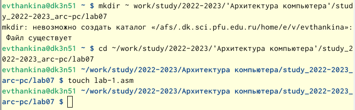{ #fig:001 width=70% }

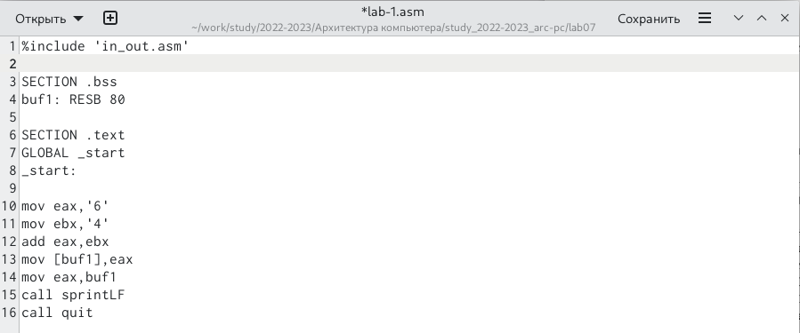{ #fig:002 width=70% }

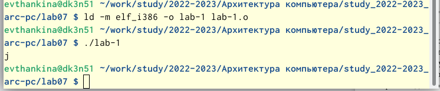{ #fig:003 width=70% }

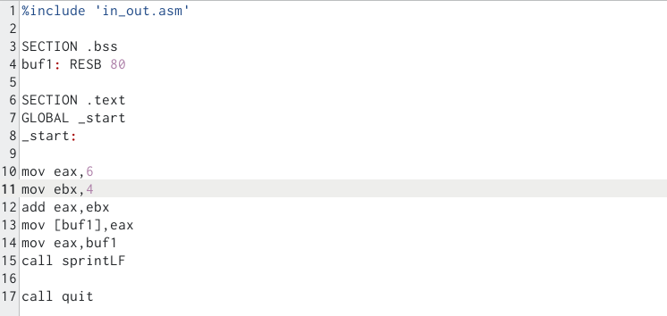{ #fig:004 width=70% }

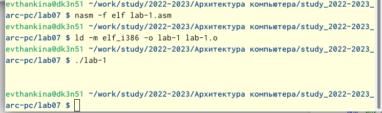{ #fig:005 width=70% }

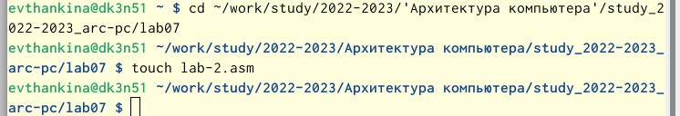{ #fig:006 width=70% }

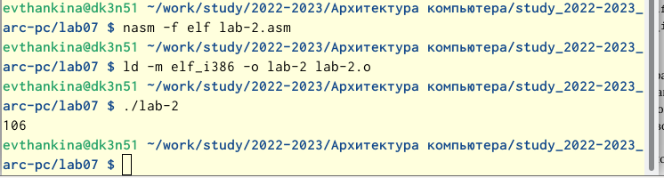{ #fig:007 width=70% }

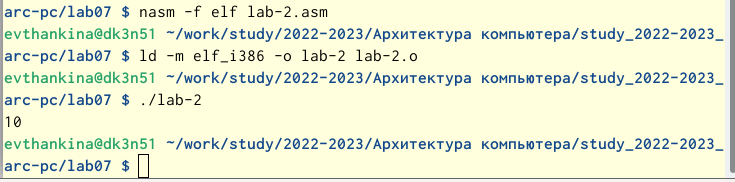{ #fig:008 width=70% }

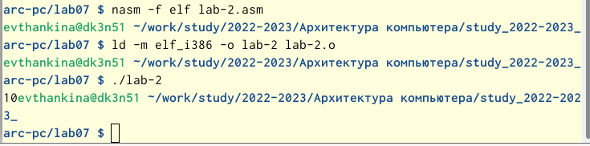{ #fig:009 width=70% }

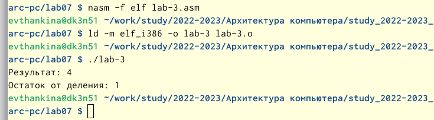{ #fig:0010 width=70% }

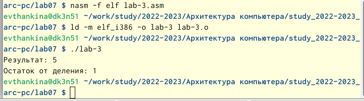{ #fig:0011 width=70% }

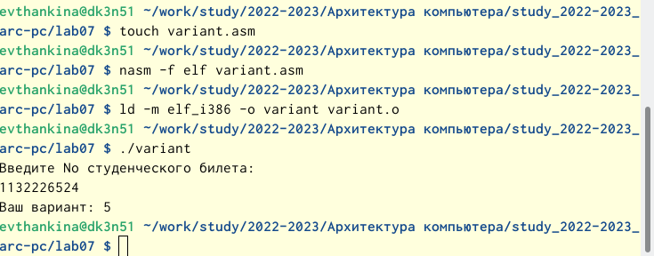{ #fig:0012 width=70% }

# Ответы на вопросы

1. mov eax,msg call sprintLF

2. Эти инструкции используются для ввода переменной x  с клавиатуры и сохранения введенных данных.

3. Эта инструкция используется для преобразования кода переменной ASCII в число.

4. mov ebx,20 div ebx inc edx

5. В регистре ebx.

6. Для увеличения значения edx на 1.

7. mov eax,edx call iprintLF 

# Выполнение самостоятельной работы

1. Написала программу вычисления выражения для своего варианта. (рис. [-@fig:0013])

2. Создала исполняемый файл и проверила. (рис. [-@fig:0014])

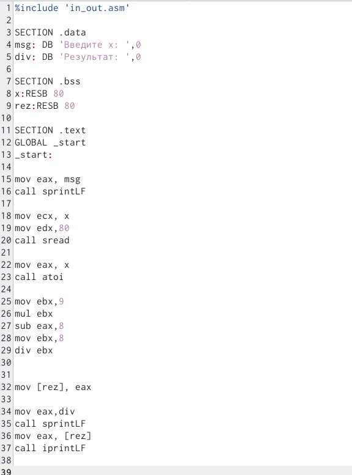{ #fig:0013 width=70% }

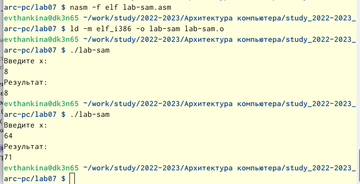{ #fig:0014 width=70% }

# Выводы

Освоила арифметические инструкции языка ассемблера NASM.

