---
## Front matter
title: "Отчет"
subtitle: "Лабораторная работа №8"
author: "Щанкина Екатерина Викторовна"

## Generic otions
lang: ru-RU
toc-title: "Содержание"

## Bibliography
bibliography: bib/cite.bib
csl: pandoc/csl/gost-r-7-0-5-2008-numeric.csl

## Pdf output format
toc: true # Table of contents
toc-depth: 2
lof: true # List of figures
lot: true # List of tables
fontsize: 12pt
linestretch: 1.5
papersize: a4
documentclass: scrreprt
## I18n polyglossia
polyglossia-lang:
  name: russian
  options:
	- spelling=modern
	- babelshorthands=true
polyglossia-otherlangs:
  name: english
## I18n babel
babel-lang: russian
babel-otherlangs: english
## Fonts
mainfont: PT Serif
romanfont: PT Serif
sansfont: PT Sans
monofont: PT Mono
mainfontoptions: Ligatures=TeX
romanfontoptions: Ligatures=TeX
sansfontoptions: Ligatures=TeX,Scale=MatchLowercase
monofontoptions: Scale=MatchLowercase,Scale=0.9
## Biblatex
biblatex: true
biblio-style: "gost-numeric"
biblatexoptions:
  - parentracker=true
  - backend=biber
  - hyperref=auto
  - language=auto
  - autolang=other*
  - citestyle=gost-numeric
## Pandoc-crossref LaTeX customization
figureTitle: "Рис."
tableTitle: "Таблица"
listingTitle: "Листинг"
lofTitle: "Список иллюстраций"
lotTitle: "Список таблиц"
lolTitle: "Листинги"
## Misc options
indent: true
header-includes:
  - \usepackage{indentfirst}
  - \usepackage{float} # keep figures where there are in the text
  - \floatplacement{figure}{H} # keep figures where there are in the text
---

# Цель работы

Изучение команд условного и безусловного переходов. Приобретение навыков написания программ с использованием переходов. Знакомство с назначением и структурой файла листинга.

# Задание

1. Изучить команды условного и безусловного переходов.
2. Приобрести навыки написания программ с использованием переходов.
3. Ознакомиться с назначением и структурой файла листинга.

# Выполнение лабораторной работы

1. Создала каталог для программ лабораторной работы No 8, перешла в него и создала файл lab8-1.asm (рис. [-@fig:001])

2. Ввела в файл lab8-1.asm текст программы из листинга 8.1, создайте исполняемый файл и запустила его.(рис. [-@fig:002]) (рис. [-@fig:003])

3. Изменила текст программы в соответствии с листингом 8.2, создала исполняемый файл и проверила его работу.(рис. [-@fig:004]) (рис. [-@fig:005])

4. Изменила текст программы изменив инструкции jmp, чтобы
вывод программы был следующим: Сообщение №3, Сообщение №2, Сообщение №1. (рис. [-@fig:006])

5. Создала файл lab8-2.asm в каталоге,внимательно изучила текст программы из листинга 8.3 и ввела в lab8-2.asm. Создала исполняемый файл и проверила его работу.(рис. [-@fig:007]  (рис. [-@fig:008])

6. Создала файл листинга для программы из файла lab8-2.asm

7. Открыла файл листинга lab8-2.lst с помощью текстового редактора. (рис. [-@fig:009]) 

8. Открыла файл с программой lab8-2.asm и в инструкции с двумя
операндами удалила один операнд. Выполнила трансляцию с получением файла
листинга. (рис. [-@fig:0010])

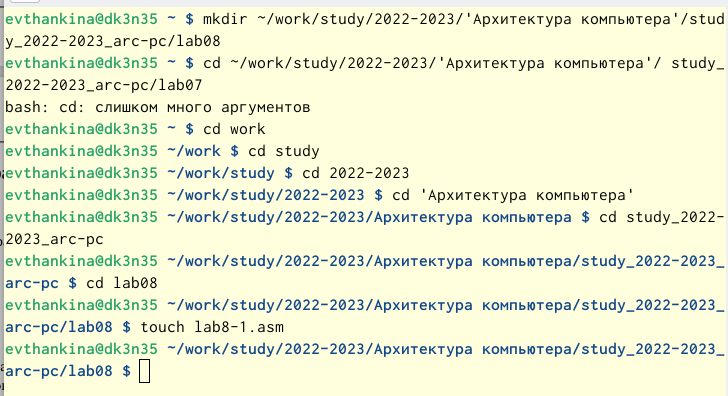{ #fig:001 width=70% }

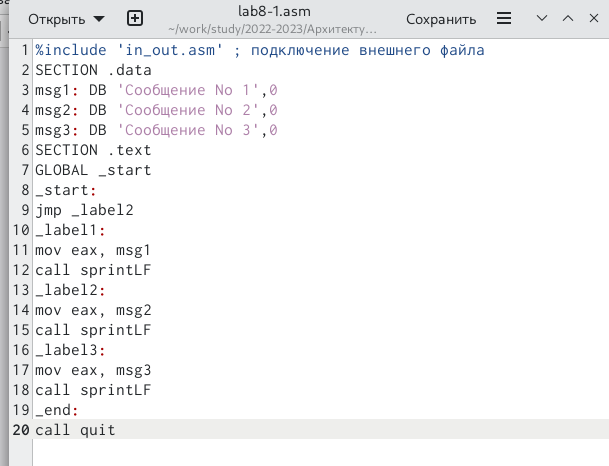{ #fig:002 width=70% }

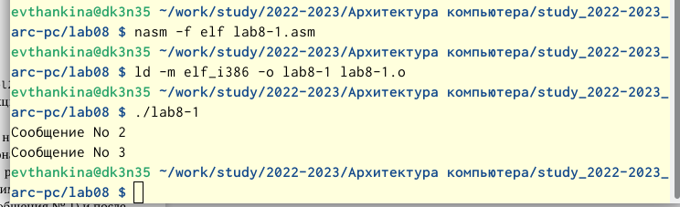{ #fig:003 width=70% }

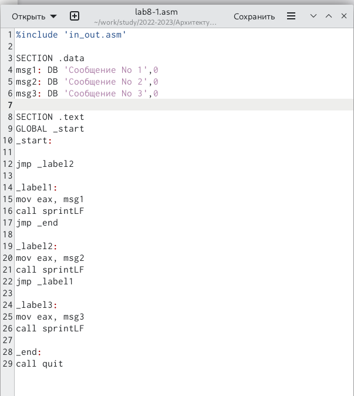{ #fig:004 width=70% }

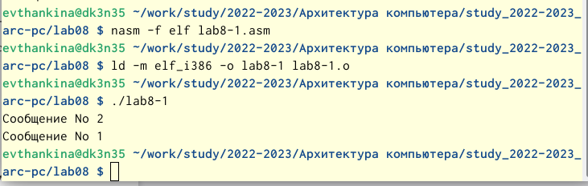{ #fig:005 width=70% }

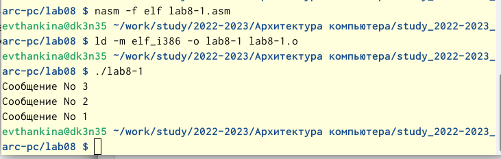{ #fig:006 width=70% }

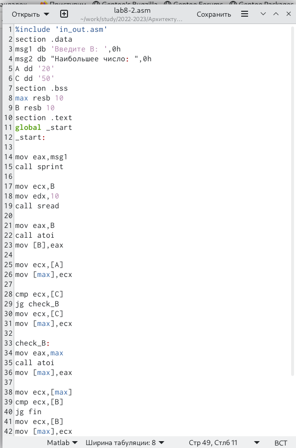{ #fig:007 width=70% }

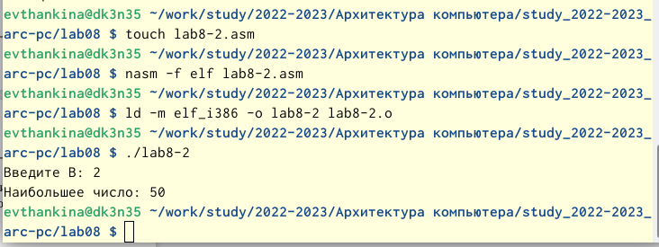{ #fig:008 width=70% }

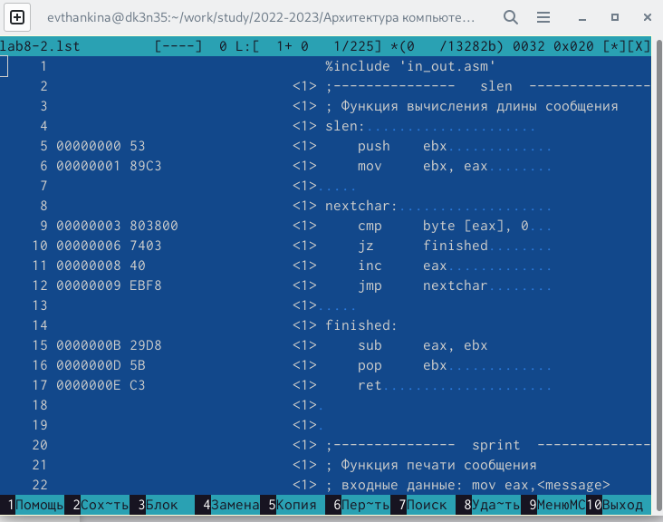{ #fig:009 width=70% }

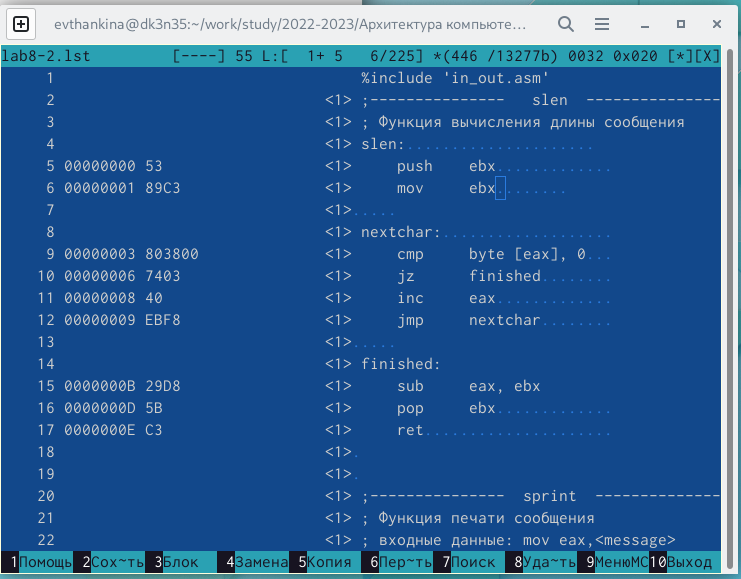{ #fig:0010 width=70% }

# Выполнение самостоятельной работы

1. Написала программу нахождения наименьшей из 3 целочисленных переменных. Создала исполняемый файл и проверила его работу. (рис. [-@fig:0011]) (рис. [-@fig:0012]) (рис. [-@fig:0013])

2. Написала программу, которая для введенных с клавиатуры значений x
и a вычисляет значение заданной функции f(x) и выводит результат вы-
числений. (рис. [-@fig:0014]) (рис. [-@fig:0015]) (рис. [-@fig:0016])

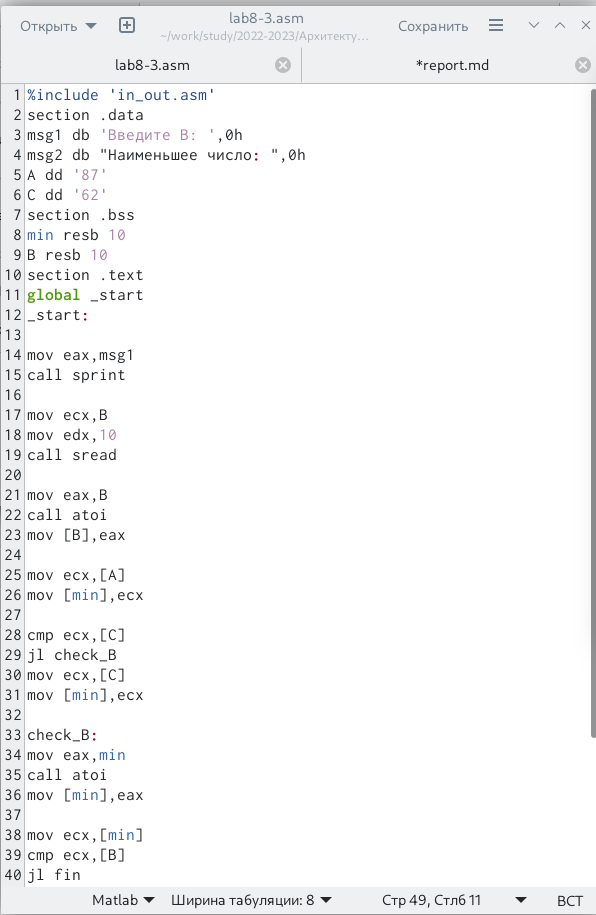{ #fig:0011 width=70% }

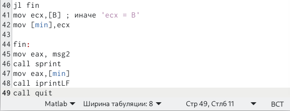{ #fig:0012 width=70% }

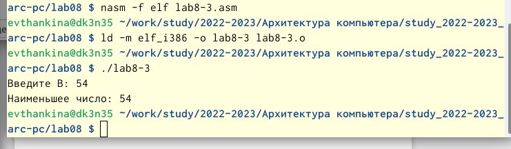{ #fig:0013 width=70% }

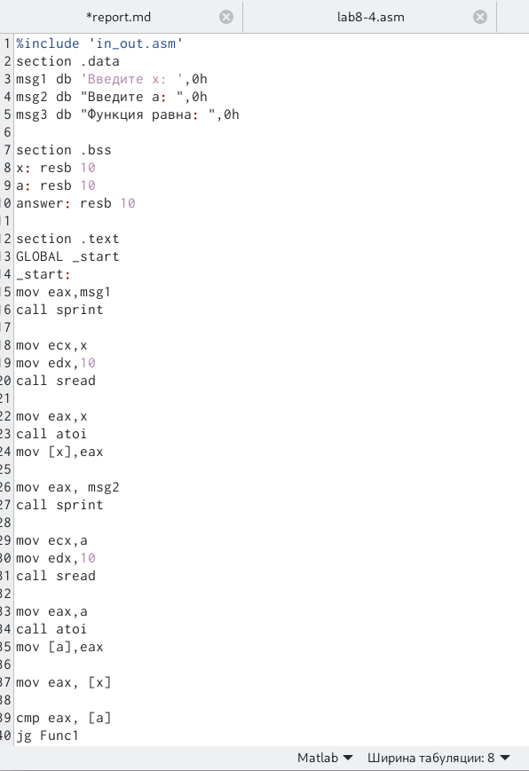{ #fig:0014 width=70% }

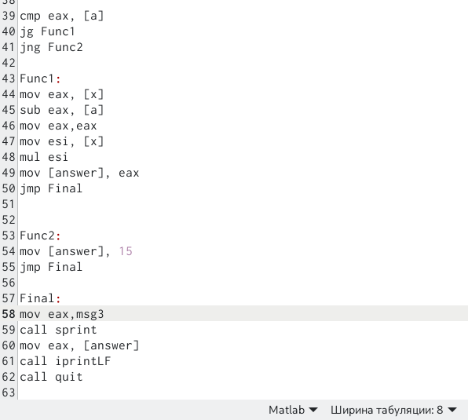{ #fig:0015 width=70% }

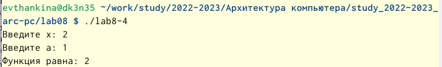{ #fig:0016 width=70% }

# Выводы

Изучила команды условного и безусловного переходов. Приобрела навыки написания программ с использованием переходов. Ознакомилась с назначением и структурой файла листинга.

# Список литературы{.unnumbered}

::: {#refs}
:::
