---
## Front matter
title: "Отчет"
subtitle: "Лабораторная работа №9"
author: "Щанкина Екатерина Викторовна"

## Generic otions
lang: ru-RU
toc-title: "Содержание"

## Bibliography
bibliography: bib/cite.bib
csl: pandoc/csl/gost-r-7-0-5-2008-numeric.csl

## Pdf output format
toc: true # Table of contents
toc-depth: 2
lof: true # List of figures
lot: true # List of tables
fontsize: 12pt
linestretch: 1.5
papersize: a4
documentclass: scrreprt
## I18n polyglossia
polyglossia-lang:
  name: russian
  options:
	- spelling=modern
	- babelshorthands=true
polyglossia-otherlangs:
  name: english
## I18n babel
babel-lang: russian
babel-otherlangs: english
## Fonts
mainfont: PT Serif
romanfont: PT Serif
sansfont: PT Sans
monofont: PT Mono
mainfontoptions: Ligatures=TeX
romanfontoptions: Ligatures=TeX
sansfontoptions: Ligatures=TeX,Scale=MatchLowercase
monofontoptions: Scale=MatchLowercase,Scale=0.9
## Biblatex
biblatex: true
biblio-style: "gost-numeric"
biblatexoptions:
  - parentracker=true
  - backend=biber
  - hyperref=auto
  - language=auto
  - autolang=other*
  - citestyle=gost-numeric
## Pandoc-crossref LaTeX customization
figureTitle: "Рис."
tableTitle: "Таблица"
listingTitle: "Листинг"
lofTitle: "Список иллюстраций"
lotTitle: "Список таблиц"
lolTitle: "Листинги"
## Misc options
indent: true
header-includes:
  - \usepackage{indentfirst}
  - \usepackage{float} # keep figures where there are in the text
  - \floatplacement{figure}{H} # keep figures where there are in the text
---

# Цель работы

Приобретение навыков написания программ с использованием циклов и
обработкой аргументов командной строки.

# Задание

Приобрести навыки написания программ с использованием циклов и обработкой аргументов командной строки.

# Выполнение лабораторной работы

1. Создала каталог для программ лабораторной работы No 9, перешла в
него и создала файл lab9-1.asm (рис. [-@fig:001])

2. Ввела в файл lab9-1.asm текст программы из листинга 9.1. Создала испол-
няемый файл и проверила его работу. (рис. [-@fig:002]) (рис. [-@fig:003])

3. Изменила текст программы добавив изменение значение регистра ecx. Создала исполняемый файл и проверила его работу. (рис. [-@fig:004]) (рис. [-@fig:003])

4. Внесла изменения в текст программы добавив команды push и pop для сохранения значения счетчика цикла loop. Создала исполняемый файл и проверила его работу. (рис. [-@fig:005]) (рис.[-@fig:003])

5. Создала файл lab9-2.asm в каталоге и ввела в него текст программы из листинга 9.2. Создала исполняемый файл и запустила его, указав аргументы. (рис. [-@fig:006]) (рис. [-@fig:007]) 

6. Создала файл lab9-3.asm в каталоге и ввела в него текст программы из листинга 9.3. Создала исполняемый файл и запустила его, указав аргументы. (рис. [-@fig:008]) (рис. [-@fig:009])

7. Изменила текст программы из листинга 9.3 для вычисления произведения аргументов командной строки. (рис. [-@fig:0010]) 

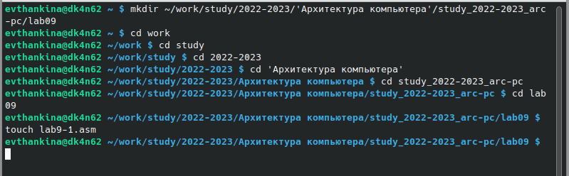{ #fig:001 width=70% }

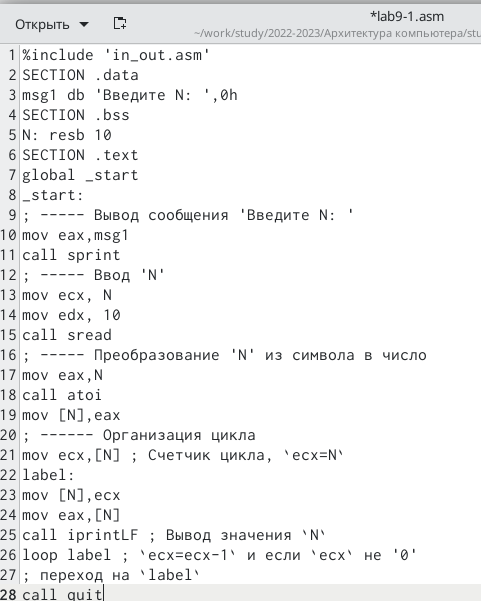{ #fig:002 width=70% }

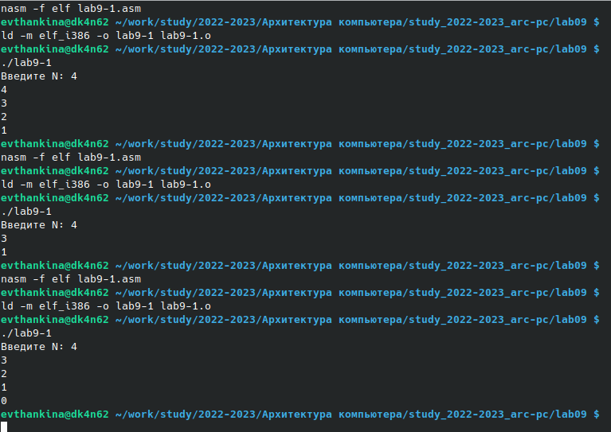{ #fig:003 width=70% }

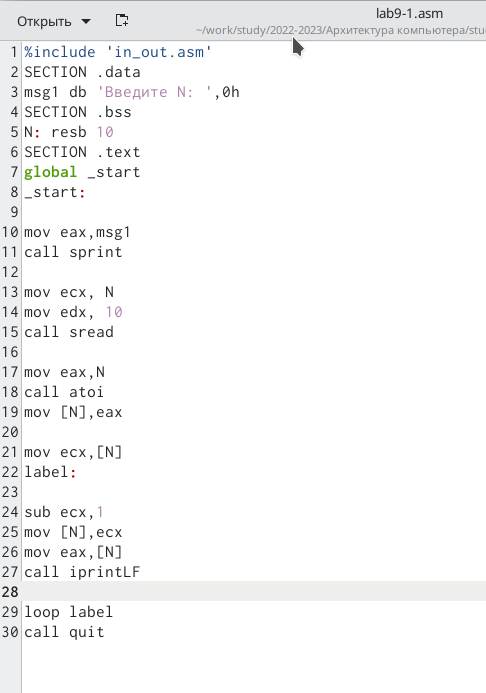{ #fig:004 width=70% }

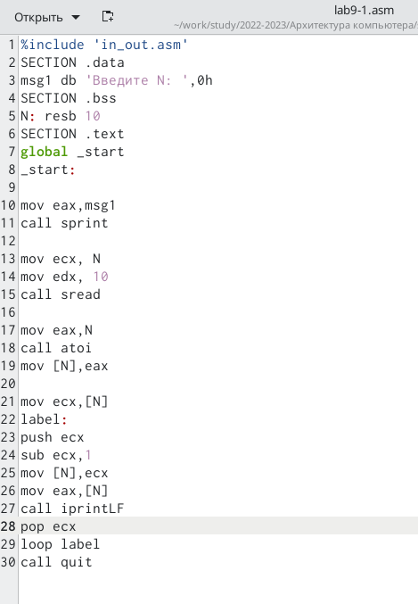{ #fig:005 width=70% }

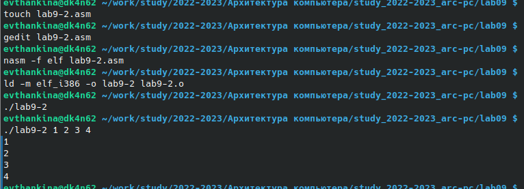{ #fig:006 width=70% }

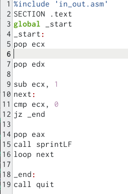{ #fig:007 width=70% }

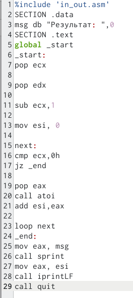{ #fig:008 width=70% }

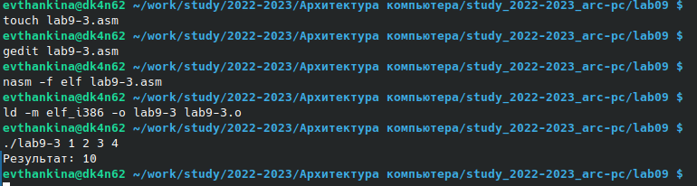{ #fig:009 width=70% }

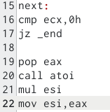{ #fig:0010 width=70% }

# Выполнение самостоятельной работы

1. Написала программу, которая находит сумму значений функции f(x)
для x = x1, x2, ..., xn, т.е. программа должна выводить значение f(x1) +
f(x2)+...+f(xn), соответствующуюю варианту 5. (рис. [-@fig:0011]) (рис. [-@fig:0012])

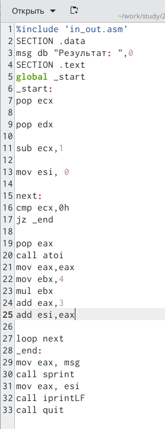{ #fig:0011 width=70% }

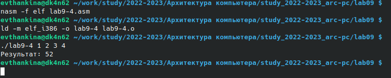{ #fig:0012 width=70% }

# Выводы

Приобрела навыки написания программ с использованием циклов и
обработкой аргументов командной строки.

# Список литературы{.unnumbered}

::: {#refs}
:::
