---
## Front matter
title: "Отчет"
subtitle: "Лабораторная работа №10"
author: "Щанкина Екатерина Викторовна"

## Generic otions
lang: ru-RU
toc-title: "Содержание"

## Bibliography
bibliography: bib/cite.bib
csl: pandoc/csl/gost-r-7-0-5-2008-numeric.csl

## Pdf output format
toc: true # Table of contents
toc-depth: 2
lof: true # List of figures
lot: true # List of tables
fontsize: 12pt
linestretch: 1.5
papersize: a4
documentclass: scrreprt
## I18n polyglossia
polyglossia-lang:
  name: russian
  options:
	- spelling=modern
	- babelshorthands=true
polyglossia-otherlangs:
  name: english
## I18n babel
babel-lang: russian
babel-otherlangs: english
## Fonts
mainfont: PT Serif
romanfont: PT Serif
sansfont: PT Sans
monofont: PT Mono
mainfontoptions: Ligatures=TeX
romanfontoptions: Ligatures=TeX
sansfontoptions: Ligatures=TeX,Scale=MatchLowercase
monofontoptions: Scale=MatchLowercase,Scale=0.9
## Biblatex
biblatex: true
biblio-style: "gost-numeric"
biblatexoptions:
  - parentracker=true
  - backend=biber
  - hyperref=auto
  - language=auto
  - autolang=other*
  - citestyle=gost-numeric
## Pandoc-crossref LaTeX customization
figureTitle: "Рис."
tableTitle: "Таблица"
listingTitle: "Листинг"
lofTitle: "Список иллюстраций"
lotTitle: "Список таблиц"
lolTitle: "Листинги"
## Misc options
indent: true
header-includes:
  - \usepackage{indentfirst}
  - \usepackage{float} # keep figures where there are in the text
  - \floatplacement{figure}{H} # keep figures where there are in the text
---

# Цель работы

Приобретение навыков написания программ с использованием подпрограмм.
Знакомство с методами отладки при помощи GDB и его основными возможно-
стями.

# Задание

Приобрести навыки написания программ с использованием подпрограмм.

Ознакомиться с методами отладки при помощи GDB и его основными возможно-
стями.

# Выполнение лабораторной работы

1. Создаем каталог для выполнения лабораторной работы, переходим в него и создаем файл. (рис. [-@fig:001])

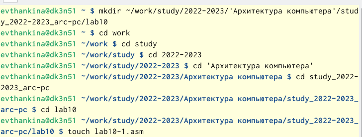{ #fig:001 width=70% }

2. Рассмотрим программу вычисления арифметического выражения с помощью подпрограммы _calcul. (рис. [-@fig:002]) (рис. [-@fig:003]) 

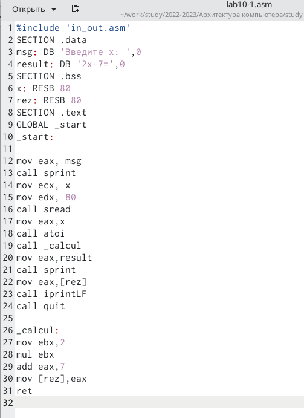{ #fig:002 width=70% }

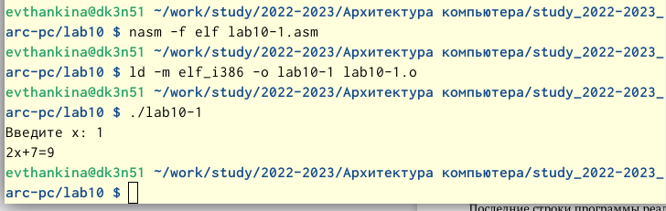{ #fig:003 width=70% }

3. Изменила программу, добавила подпрограмму g(x)=3x-1 (рис. [-@fig:004]) (рис. [-@fig:005]) 

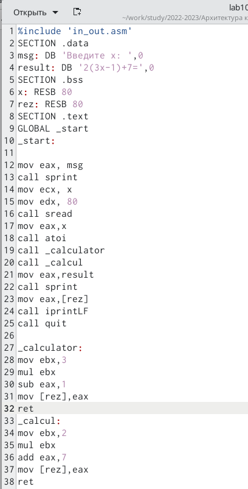{ #fig:004 width=70% }

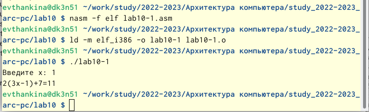{ #fig:005 width=70% }

 Программа работает правильно, ведь если мы подставим x=1, то получим 11.

4. Создала файл lab10-2.asm для Листинга №2. Написала программу печати сообщения Hello world!. (рис. [-@fig:006]) 

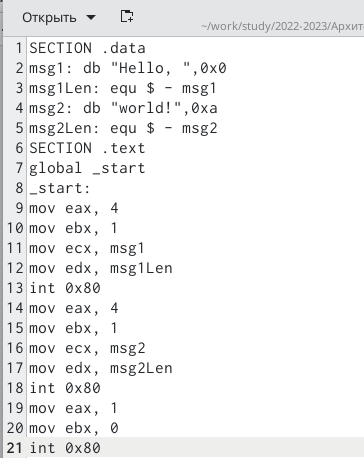{ #fig:006 width=70% }

5. Проверила работу программы. (рис. [-@fig:007])

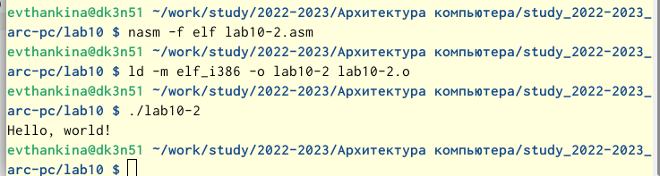{ #fig:007 width=70% }

6. Загрузила исполняемый файл в отладчик. (рис. [-@fig:008]) 

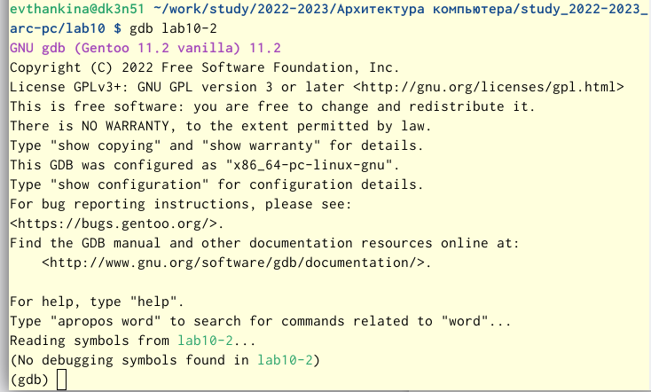{ #fig:008 width=70% }

 Проверим работу программы с помощью запуска в оболочке GDB c помощью команды 'run'.(рис. [-@fig:009]) 
 Установила брейкпоинт на метку _start и запустила программу. (рис. [-@fig:009]) 
 Посмотрела дисассимблированный код программы с помощью команды disassemble начиная с метки _start (рис. [-@fig:009]) 

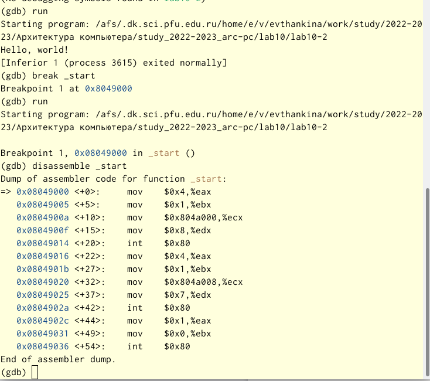{ #fig:009 width=70% } 

Переключилась на отображение команд с помощью команды set disassembly-flavor intel. (рис. [-@fig:0010]) 

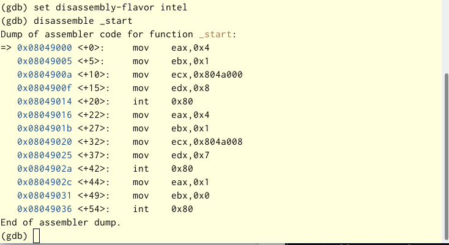{ #fig:0010 width=70% }

Включила режим псевдографики.(рис. [-@fig:0011]) 

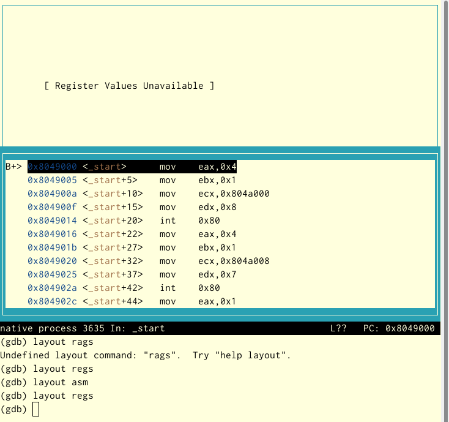{ #fig:0011 width=70% }

В режиме псевдографики у нас есть три окна:
- в верхней части названия регистров и их текущие значения.
- в средней части результат дисассимилирования программы
- в нижней части мы можем вводить команды
Различия синтаксиса машинных комнад в режимах ATT и Intel заключаются в том, что в синтаксисе Intel не используются символы $ и %,операнды меняются местами.

7. Проверим точки останова с помощью команды "info breakpoints". (рис. [-@fig:0012])

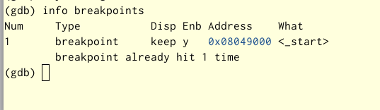{ #fig:0012 width=70% }

Установила точку останова по адресу инструкции (ebx,0x0) (рис. [-@fig:0013])

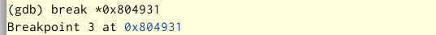{ #fig:0013 width=70% }

8. Выполнила 5 инструкций с помощью команды stepi и проследила значение регистров. (рис. [-@fig:0014])
Мы можем увидеть, что изменяются значения регистров eax, ebx, ecx, edx.

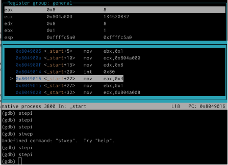{ #fig:0014 width=70% }

Команда 'x' позволяется посмотреть содержимое памяти. (рис. [-@fig:0015]) (рис. [-@fig:0016])

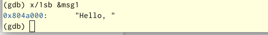{ #fig:0015 width=70% }

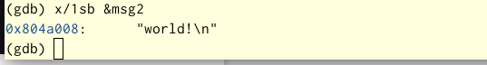{ #fig:0016 width=70% }

Воспользуемся командой set, которая помогает изменить значение для регистра и ячейки. (рис. [-@fig:0017])

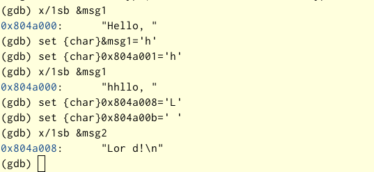{ #fig:0017 width=70% }

С помощью команды 'set' изменила значение регистра ebx. (рис. [-@fig:0018])

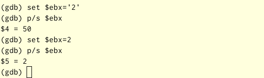{ #fig:0018 width=70% }

Различие в том, что код символа "2" - "110010" а это есть число 50.

9. Копируем файл из лабораторной работы №9 с новым именем и создаем исполняемый файл.
Для загрузки в GDB программы с аргументами нужно использовать ключ -args. (рис. [-@fig:0019])

Чтобы исследовать расположение аргументов командной строки усталовим точку останова и запустим команду. (рис. [-@fig:0019])

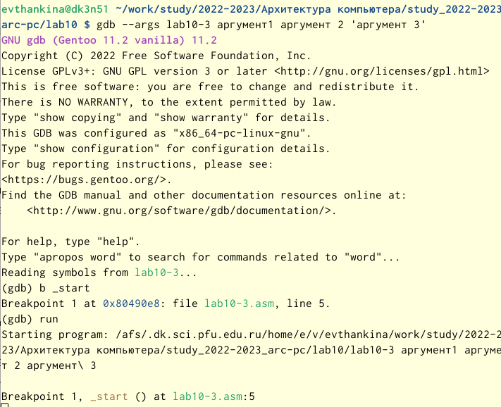{ #fig:0019 width=70% }

Посмотрим позиции стека.(рис. [-@fig:0020])

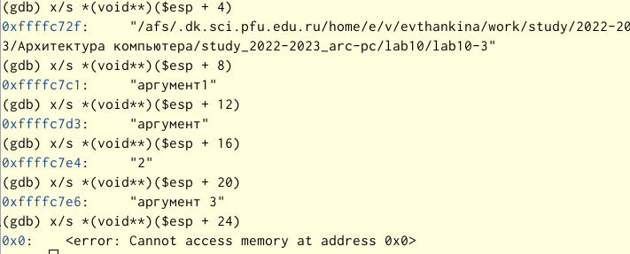{ #fig:0020 width=70% }

В данном случае шаг изменения адреса равен 4, т.к. в теле цикла next 4 строки ввода.

# Выполнение самостоятельной работы

1. Скопировала файл из 9 лабораторной работы с помощью команды cp. (рис. [-@fig:0021])

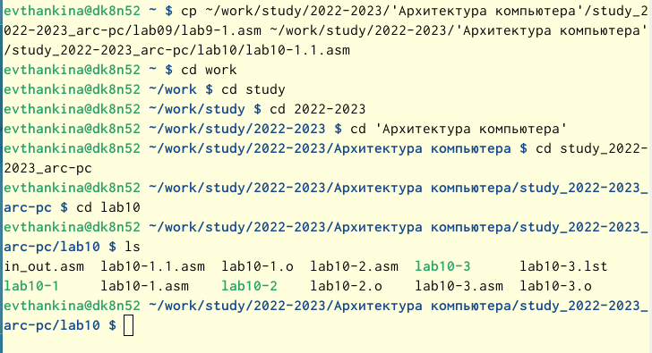{ #fig:0021 width=70% }

Изменила программу с использованием подпрограмм и запустила ее. (рис. [-@fig:0022]) (рис. [-@fig:0023])

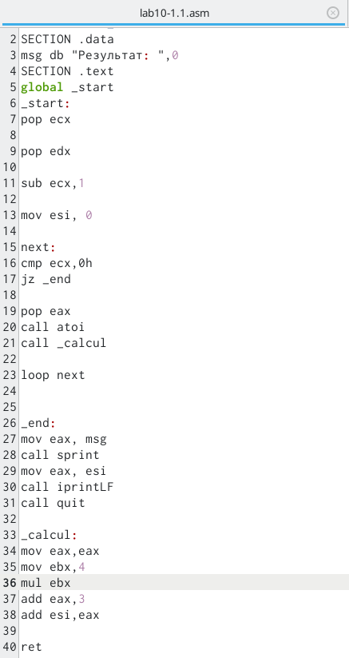{ #fig:0022 width=70% }

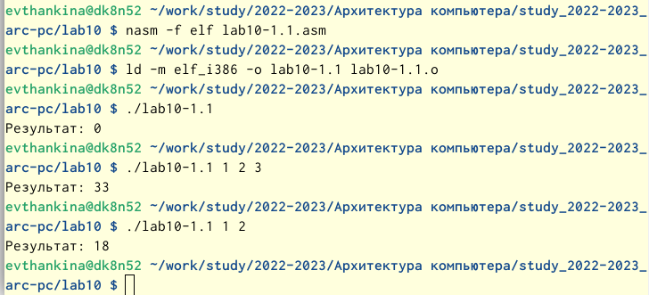{ #fig:0023 width=70% }

2. Написала программу из листинга и проверила с помощью отладчика. (рис. [-@fig:0024])

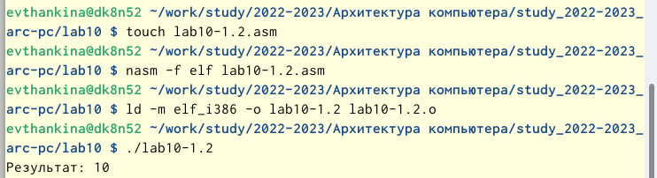{ #fig:0024 width=70% }

 Результат программы неверный, для устранения ошибки запускаем отладчик.(рис. [-@fig:0025])
Далее установила точку останова. (рис. [-@fig:0025])

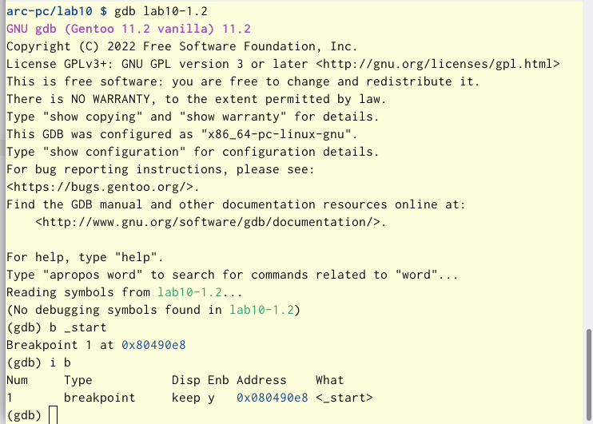{ #fig:0025 width=70% }

Запустила код программы с помощью команды run. (рис. [-@fig:0026])

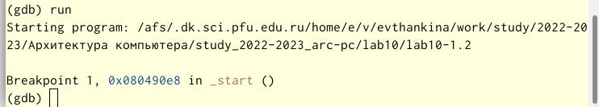{ #fig:0026 width=70% } 

Включила режим псевдографики и пошагово прошла все строчки.(рис. [-@fig:0027])

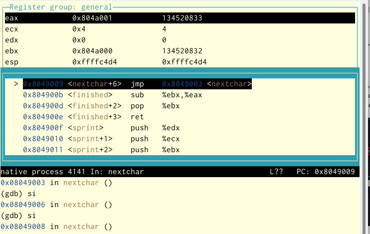{ #fig:0027 width=70% } 

Мы можем увидеть, что регистр eax  должен умножаться на 4, но умножался регистр ebx.
А еще число 5 прибавлялось не к произведению, а только к ebx. Исправим ошибки. (рис. [-@fig:0028]) (рис. [-@fig:0029])

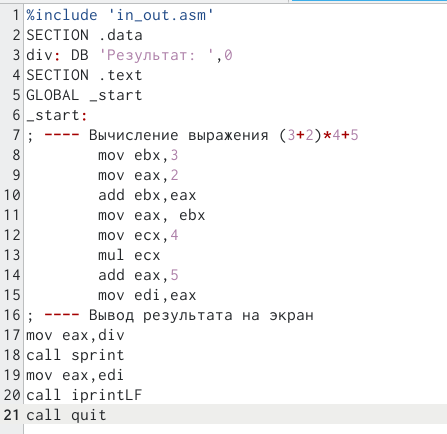{ #fig:0028 width=70% }

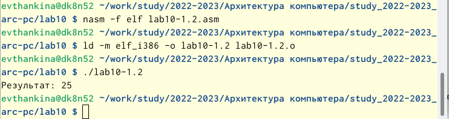{ #fig:0029 width=70% }

Программа работает верно.

# Выводы

Приобрела навыки написания программ с использованием подпрограмм.Познакомилась с методами отладки при помощи GDB и его основными возможностями.

# Список литературы{.unnumbered}

::: {#refs}
:::
