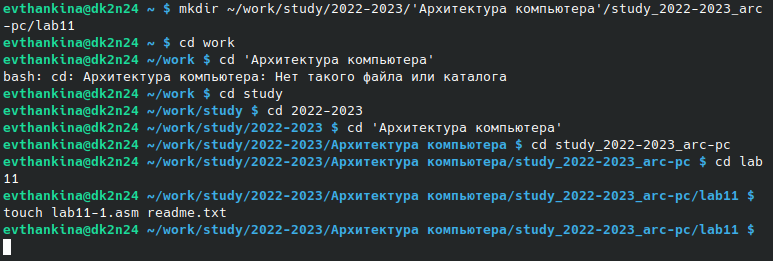
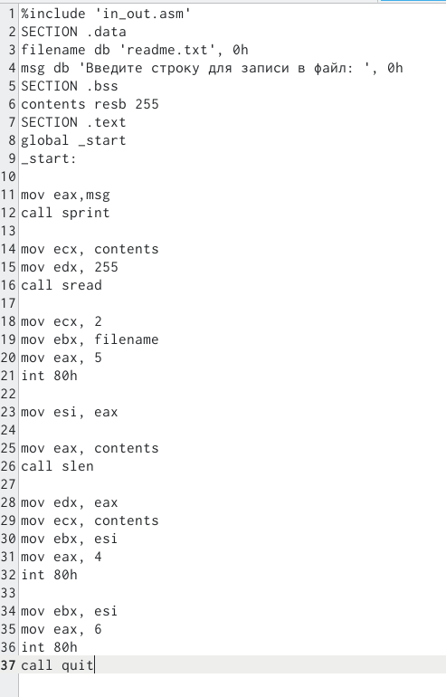
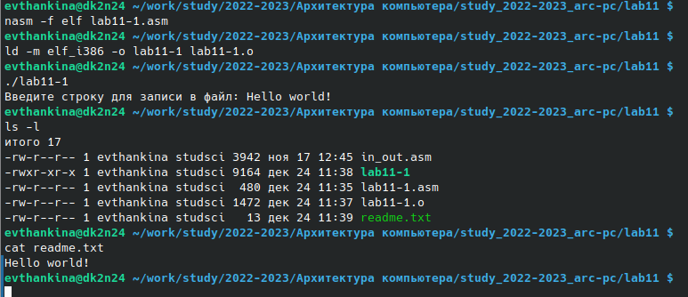
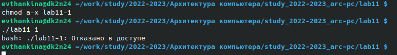
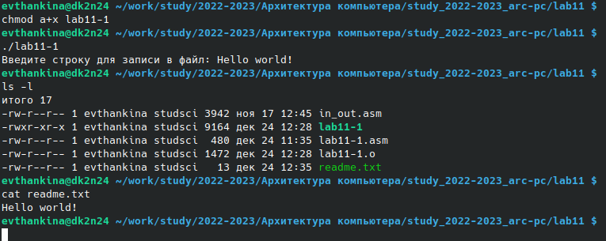
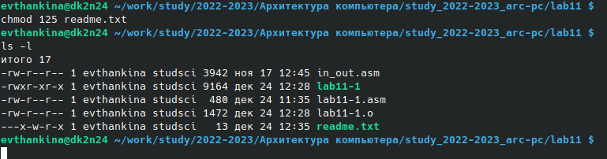
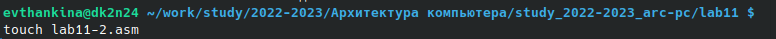
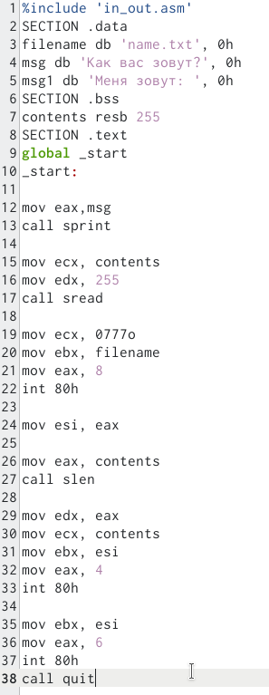
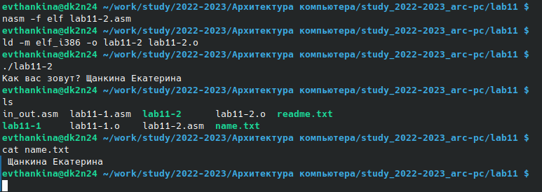

---
## Front matter
title: "Отчет"
subtitle: "Лабораторная работа №11"
author: "Щанкина Екатерина Викторовна"

## Generic otions
lang: ru-RU
toc-title: "Содержание"

## Bibliography
bibliography: bib/cite.bib
csl: pandoc/csl/gost-r-7-0-5-2008-numeric.csl

## Pdf output format
toc: true # Table of contents
toc-depth: 2
lof: true # List of figures
lot: true # List of tables
fontsize: 12pt
linestretch: 1.5
papersize: a4
documentclass: scrreprt
## I18n polyglossia
polyglossia-lang:
  name: russian
  options:
	- spelling=modern
	- babelshorthands=true
polyglossia-otherlangs:
  name: english
## I18n babel
babel-lang: russian
babel-otherlangs: english
## Fonts
mainfont: PT Serif
romanfont: PT Serif
sansfont: PT Sans
monofont: PT Mono
mainfontoptions: Ligatures=TeX
romanfontoptions: Ligatures=TeX
sansfontoptions: Ligatures=TeX,Scale=MatchLowercase
monofontoptions: Scale=MatchLowercase,Scale=0.9
## Biblatex
biblatex: true
biblio-style: "gost-numeric"
biblatexoptions:
  - parentracker=true
  - backend=biber
  - hyperref=auto
  - language=auto
  - autolang=other*
  - citestyle=gost-numeric
## Pandoc-crossref LaTeX customization
figureTitle: "Рис."
tableTitle: "Таблица"
listingTitle: "Листинг"
lofTitle: "Список иллюстраций"
lotTitle: "Список таблиц"
lolTitle: "Листинги"
## Misc options
indent: true
header-includes:
  - \usepackage{indentfirst}
  - \usepackage{float} # keep figures where there are in the text
  - \floatplacement{figure}{H} # keep figures where there are in the text
---

# Цель работы

Приобретение навыков написания программ для работы с файлами.

# Выполнение лабораторной работы

1. Создала каталог для программам лабораторной работы No 11, перешла
в него и создала файл lab11-1.asm и readme.txt (рис. [-@fig:001])

{ #fig:001 width=70% }

2. Ввела в файл lab11-1.asm текст программы из листинга 11.1. Создала исполняемый файл и проверила его работу. (рис. [-@fig:002]) (рис. [-@fig:003])

{ #fig:002 width=70% }

{ #fig:003 width=70% }

3. С помощью команды "chmod a-x lab11-1"  изменила права доступа к исполняемому файлу
lab11-1, запретив его выполнение. Попыталась выполнить файл и получили следующий результат, так как выполнение файла ограничено. (рис. [-@fig:004])

{ #fig:004 width=70% }

4. С помощью команды "chmod a+x lab11-1" изменила права доступа к файлу lab11-1.asm с
исходным текстом программы, добавив права на исполнение. Выполнила его, так как с помощью этой команды вернула права на исполнение.(рис. [-@fig:005])

{ #fig:005 width=70% }

5. Предоставила права доступа к файлу readme.txt в соответствии с вари-
антом №5. Проверила правильность выполнения с помощью команды ls -l. (рис. [-@fig:006])

{ #fig:006 width=70% }

# Выполнение самостоятельной работы

1. Создала файл для самостоятельной работы. (рис. [-@fig:007])

{ #fig:007 width=70% }

2. Написала  программу, работающую по алгоритму (рис. [-@fig:008]):

• Вывод приглашения “Как Вас зовут?”

• ввести с клавиатуры свои фамилию и имя

• создать файл с именем name.txt

• записать в файл сообщение “Меня зовут”

• дописать в файл строку введенную с клавиатуры

• закрыть файл

{ #fig:008 width=70% }

Создала исполняемый файл и проверила его работу. Проверила наличие файла и его содержимое с помощью команд ls и cat. (рис. [-@fig:009])

{ #fig:009 width=70% }

# Выводы

Приобрела навыки написания программ для работы с файлами.

